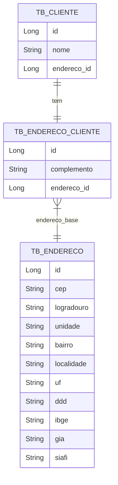
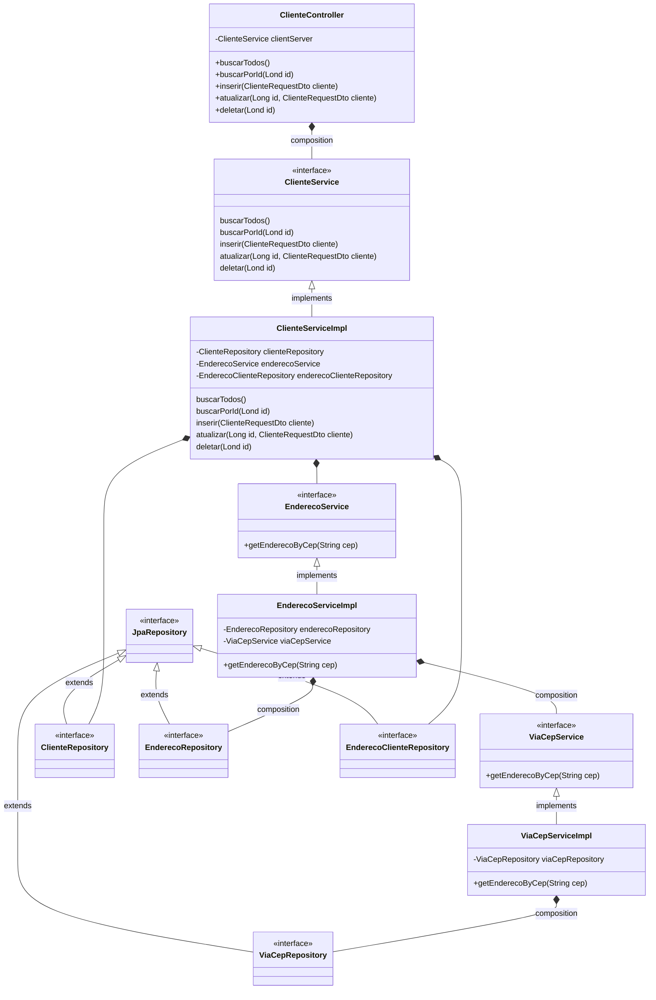
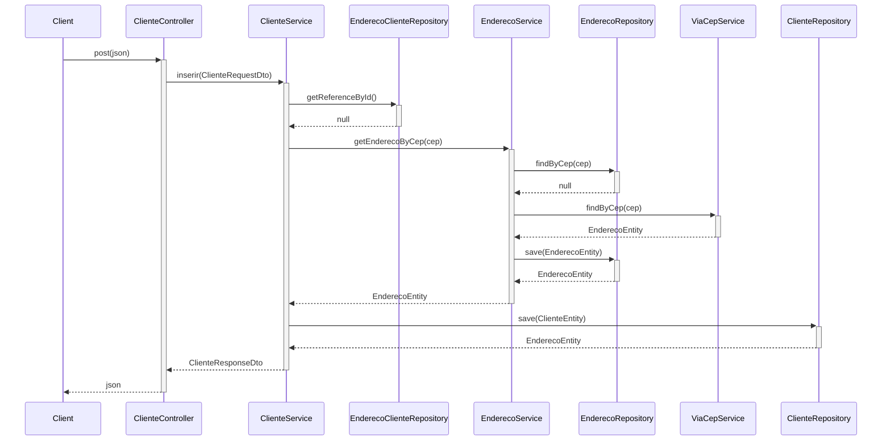

# :question: Sobre

Esse projeto é um exercício da aula da **DIO "Explorando Padrões de Projetos na Pratica com Java"** onde o código fonte
do projeto original se encontra neste [link](https://github.com/digitalinnovationone/lab-padroes-projeto-spring).

O projeto original contempla os padrões **Strategy/Repository, Singleton e Facade** utilizando Spring, e com base no
projeto apresentado resolvi aprimorar.

O projeto atual utiliza:

* Java 21
* Spingboot 3
* Swagger 3
* Projeto Lombook
* H2 Dtabase
* JUnit 5

Temos neste projeto os seguintes Design Patters:
|Creatinal|Sturctural|Behayioural
|--|--|--|
|Singleton|Adapter|Strategy|
|Factory|Decorator| |
|Builder|Facade| |

Trata-se de uma API simples de cadastro de clientes com endereço, com métodos de recuperar todos, recuperar um pelo id,
criar, atualizar e apagar. Os dados para cadastro e atualização são somente nome do cliente, cep e complemento. Temos um
banco com 3 tabelas, uma de cliente, uma de endereço de cliente e outra de endereço, como podemos ver no diagrama
abaixo:

A ideia de ser ter duas tabelas de endereço é que a tabela de endereço tem seus dados repetidos, por exemplo, em um
condomínio de muitas unidades todas terão a mesma base de endereço porque o cep é o mesmo, mudando somente o bloco e o
apartamento, dados estes que serão armazenados na coluna complemento da tabela tb_endereco_cliente.

A tabela tb_endereco é preenchida automaticamente com base no cep passado sendo feita uma consulta no serviço externo
ViaCep. E na próxima vez que for feito outro cadastro com o mesmo cep o registro é reaproveitado, não sendo necessário
uma nova consulta ao serviço e sem duplicar dados.

Resumidamente a arquitetura de classes está assim:

Vamos exemplificar com o diagrama de sequência de inclusão:

 

